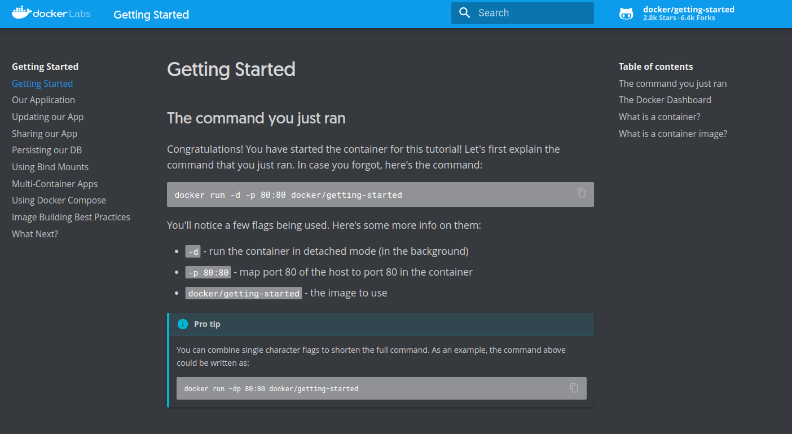
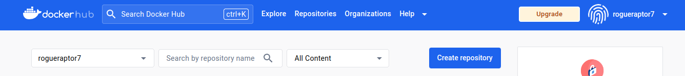
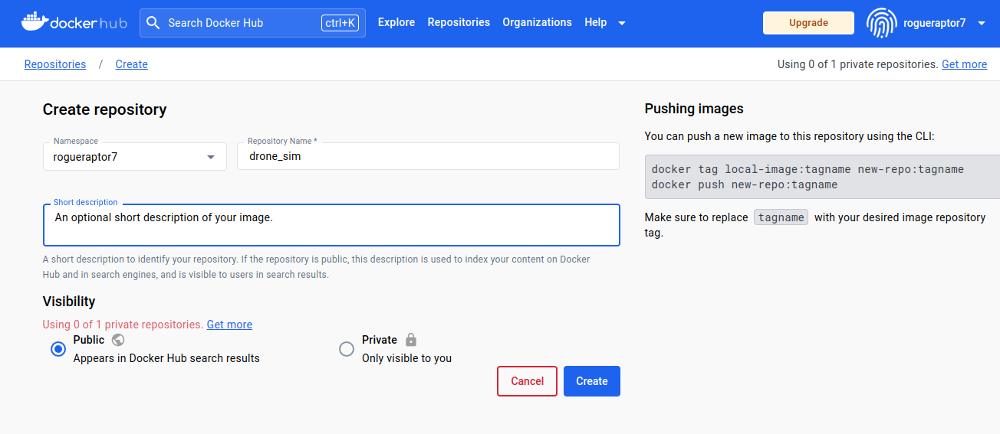
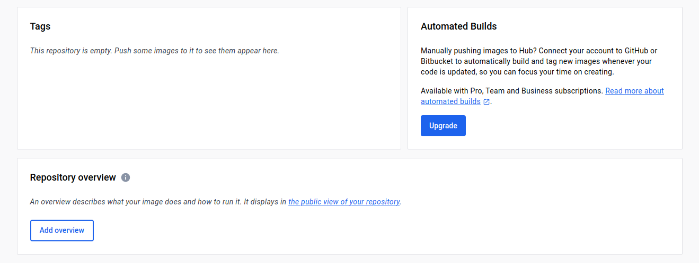

# Workshop - Docker 

You may work in groups on this workshop. 

In this workshop, you will be using Docker to containerize a Terrain Simulation application. Containerization allows 
developers to ship and deploy projects easily without users needing to setup complicated dependencies or directory structures.
By the end of this workshop, you will have a Docker image that contains your project code and can be run on any machine 
(that has Docker installed) with a single command.

## Prerequisites
You should already have Docker installed, as well as an account on Docker Hub.
If you don't have Docker installed yet, instructions can be found here ([Windows](https://docs.docker.com/desktop/install/windows-install/),
[macOS (Apple Silicon & Intel)](https://docs.docker.com/desktop/install/mac-install/), [Linux](https://docs.docker.com/desktop/install/linux-install/)). If you don't have a DockerHub account, create one here (don't use 
your UMN email, you might lose access to this after you graduate): https://hub.docker.com.

### Windows

Commands given to you for this workshop should be run within the WSL terminal. To open a WSL terminal, click the search/Windows icon and type "WSL". If you are using VSCode, open a new terminal, then in the bottom right corner on the "terminal bar" there should be a dropdown arrow next to the + button, select WSL, this should open a new WSL terminal on your computer.

### macOS/Linux

Run all commands for this workshop in a terminal on your local computer. You may use the built-in terminal in VSCode.

___

### Helpful Cheat Sheet
This workshop touches on just a few Docker concepts, useful terminal commands and Dockerfile syntax can be found 
in this [cheat sheet](https://docs.docker.com/get-started/docker_cheatsheet.pdf) with some 
more description. Not all concepts in this cheat sheet will be used for this workshop.


## Checkpoint 1 - Login to DockerHub, run a Docker container

Before working on our own Docker images, let's make sure Docker is working properly by running an existing image.
### Login to DockerHub
1. Launch the Docker desktop app and make sure it's running.
2. In your terminal, we are going to connect your machine to DockerHub to push and pull images. Run the following command:

```bash
docker login
```

Enter you username/password for DockerHub.

### Run your first Docker container

To verify Docker is installed correctly, run the following command in your terminal.
```bash
docker run --rm -d -p 80:80 docker/getting-started
```
* `--rm` - delete the container as soon as it's stopped
* `-d` - run the container in detatched mode
* `-p 80:80` - map the host machine's port 80 to the container's port 80, i.e. `hostport:containerport`
* `docker/getting-started` - the name of the image to instantiate a container from

This will automatically pull the `docker/getting-started` image from DockerHub, then run it, which will start a web 
server on port 80 of your local machine. 

Go to <a href="http://localhost" target="_blank">http://localhost</a>, you should see the following page



In your terminal, you can see containers that are currently running with the following command

```bash
docker ps

# CONTAINER ID   IMAGE                    COMMAND                  CREATED         STATUS         PORTS                               NAMES
# fe9a00f50212   docker/getting-started   "/docker-entrypoint.…"   6 minutes ago   Up 6 minutes   0.0.0.0:80->80/tcp, :::80->80/tcp   romantic_zhukovsky
```

This container is running in the background, let's stop it. Note: **the container will be deleted** since we used 
the `--rm` flag when we started the container.

```bash
# docker kill <CONTAINER ID>
docker kill fe9a00f50212
```
`<CONTAINER ID>` can be copied from the result of your previous `docker ps` call.

## Checkpoint 2 - Writing the Dockerfile
**WARNING**: For any Mac users with M1/2/3 chips, make sure to switch the `FROM` instruction at the top of the `Dockerfile` (mentioned in Dockerfile comments).

In this repository, we've provided a `Dockerfile`. Your task is to modify this Dockerfile to run your Drone Simulation when 
the container is started. The Dockerfile already has some code in it, as well as comments for guidance on what you will
need to add. You will need to use the following commands 


```Dockerfile
RUN <command>     # allows you to run any linux command you would on a labs machine (if using ubuntu image)

COPY <src> <dest> # copies files on local computer to specified location in the Docker container

WORKDIR <path>    # changes the directory in the Docker container (similar to how "cd" works in linux)

CMD [ "list", "of", "args" ] # a bash command the container executes when the container is started
```
A more detailed description of these instructions can be found in this [cheat sheet](cheatsheet.md).

The command that needs to run when the Docker container is run is not the standard `make run`, but rather the more direct command:

`./build/bin/web-app 8081 apps/web-app/web data/scenes/default.json`

Once you think you've completed the Dockerfile, move on to Checkpoint 3 to see if the image builds successfully. If it fails,
you'll need to edit your Dockerfile and build it again.

## Checkpoint 3 - Building the Docker Image
To build a Docker image, you must navigate to the directory containing your Dockerfile, then run:
```bash
# docker build -t <dockerhub_username/repository> <dockerfile_location>
docker build -t <user>/terrain_sim .
```

This call invokes the commands outlined in the Dockerfile and builds our image. The `-t` flag specifies what we want 
to name our image. The image name must be your DockerHub username foward slash drone_sim. The image name is this FULL 
string (`dockerhub_username/repository` e.g. `<user>/terrain_sim`). 

`dockerfile_location` is the relative file path to our Dockerfile. Since our Dockerfile is in 
the current directory, `<dockerfile_location>` will just be `.`

If you get errors during the build process, make sure your `Dockerfile` is correct. It could also be the case that 
your `Dockerfile` is in the wrong folder relative to your project, or you're not in the same directory as your `Dockerfile`.

## Checkpoint 4 - Running the Docker Image
Once you've made the necessary changes to the Dockerfile and your image builds without issue, it's finally time to see if it works.

The command you will use to run the Docker image is:
```bash
docker run --rm -it -p <hostport>:<containerport> <image_name>
```
The host port should be 8081 and the container port must be 8081. 

You'll notice we're using the same flags as the command we ran in Checkpoint 1 _except_ for the `-it` flag:
* `-it` - attach an interactive terminal to the container when it runs

Verify your Drone Simulation is running properly by going to http://localhost:8081.

As you visit these pages and schedule trips, you will see the output of your program in your terminal. Use `CTRL`+`c` 
to kill the container. If this doesn't work, 
you can hit `CTRL`+`P`+`Q` to detach your container, then type `docker ps` to find the container, then 
`docker kill <CONTAINER ID>` to stop it.


## Submission - Deploying Image to DockerHub
Once you've verified that your image works, you need to make a repository on DockerHub and **add an overview**. The 
repository name must match the image name **exactly**, so you should name the repo `terrain_sim`. Create the repository 
by clicking the 'Create repository' button. Note: Docker is the desktop application you have on your computer, and DockerHub is
a page that you will visit in your browser. You will only be able to create the repository in DockerHub.



Then fill out the repo name, add a short description (this is NOT the required overview), and leave visibility as public.
Click the 'Create' button when finished.




Then on the repository page, at the bottom click the "add overview" button. 



Type two sentences describing this project:

1. What is the software being run in this image?
2. What command do you use to build the image? What command to run the container?

**You must add an overview to get full points**. 

Next, you can push your image up to DockerHub with the following command:
```bash
docker push <image_name>
```
Make sure to use the full image name (e.g. `<user>/terrain_sim`).

This will take a minute or two, depending on your internet connection.

**Double check your image shows up in DockerHub after you push.**

Finally, in Canvas, you will submit your URL link to your Docker image on DockerHub, i.e. `https://hub.docker.com/repository/docker/<user>/terrain_sim/general`.

If you worked in a group, submit the link for the image that the group uploaded.
